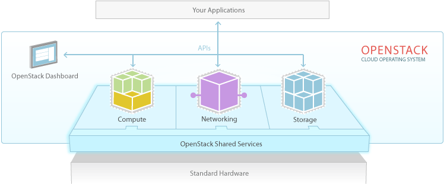

# Introdução
---
O OpenStack engloba um conjunto de softwares de código aberto que objetiva o gerenciamento de infraestruturas virtualizadas. Muitas vezes chamado de "Sistema Operacional da Nuvem", o OpenStack possúi uma forte comunidade que conta com nomes como VMware, IBM, Cisco, Dell, Red Hat, Canonical, dentre outros,  contribuindo para o seu desenvolvimento. Além disso, ele é utilizado por uma [vasta gama de usuários](https://www.openstack.org/user-stories/) em todos os setores da sociedade.

*OpenStack, o Sistema Operaciona da Nuvem, [fonte](http://www.openstack.org/software/).*

Os diversos componentes que compõe o OpenStack se integram por meio de uma arquitetura modular
