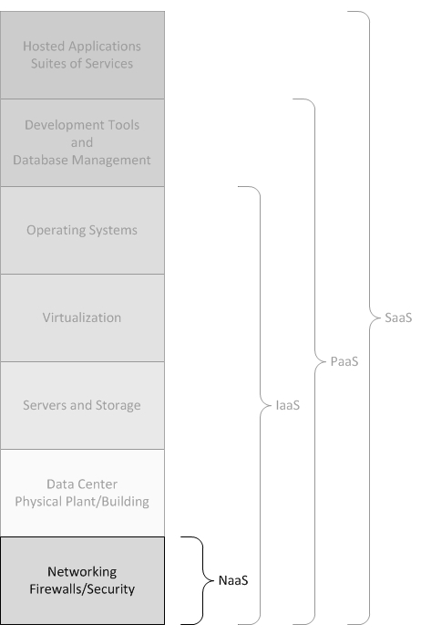

# Computação em Nuvem
---

Computação em Nuvem, muitas vezes tida por "computação sob demanda", se trata de um sistema computacional no qual recursos, dados e informações são fornecidos a computadores e dispositivos conectados à internet sob demanda, se espelhando no princípio de computação em GRID. Em sua idealização, o usuário final acessa a rede em um dispositivo, tal qual um terminal, que faz a requisção de recursos computacionais e/ou dados. Essa requisiçãoé atendida remotamente por meio da infraestrutura da nuvem distribuída pela internet e, por fim, os dados e processamento destinados a esse usuário são mantidos na infraestrutura remota.

*Computação em nuvem. [Fonte](https://pt.wikipedia.org/wiki/Ficheiro:Computa%C3%A7%C3%A3o_em_nuvem.svg).*

A utilização da nuvem possui várias vantagens tanto para o usuário quanto para o provedor da aplicação. Nesse ambiente, o provedor dispõe de uma poderosa infraestrutura computacional, mesmo que não tenha acesso a ela fisicamente. Ademais, se vê livre dos custos de manutenção de hardware, ao passo em que se torna capaz a oferecer um serviço mais estável e com melhor gerenciamento de carga. Todas esses pontos contribuem para uma melhor experiência do usuário final. Nesse sentido, surge o entendimento da nuvem como um meio para o desenvolvimento da computação como um serviço.

## XaaS - Tudo como um Serviço
---

"Xaas" significa, justamente, "X as a Service". Com o desenvolvimento da computação em nuvem esse tipo de nomeclatura passou a ser utilizado para representar serviços providos por meio da nuvem. Os mais comuns são:

* SaaS - Software as a Service: como Google Apps, Dropbox, Spotify
* PaaS - Platform as a Service: como Heroku, Cloud Foundry, Google App Engine, OpenShift
* IaaS - Infrastructure as a Service: como OpenStack, CloudStack, Amazon AWS, Microsoft Azure, Google Compute Engine
* NaaS - Network as a Service: como FENICS, Aryaka

*XaaS. Ressalte em NaaS. [Fonte](http://www.service-architecture.com/articles/cloud-computing/network_as_a_service_naas.html).*

### NaaS - Rede como Serviço
---

Se trata da integração dos serviços em nuvem com o cliente, por meio de um acesso direto à infraestrutura de rede. Por meio desse serviço o cliente pode personalisar o roteamneto da rede em que seus outros serviçoes estão distribuídos e implantar protocolos de multicast de maneira fácil. Ademais, o usuário pode implantar serviços anvançados de rede, como a modificação depacotes "in-path".

As funcionalidades desse tipo de serviçopodem ser divididas em:

* **Processamento In-network**:  É possível a redução do tráfego total da rede, e consequente redução dos tempos de execução de serviços que a utilizam, uma vez realizada a agregação em rede. Essa agregação, contudo, é específica ao aplicativo distribuídopelarede, portanto não é fornecida como um serviço de rede.

* **Fowarding Customizado**: É possível a implementação de protocolos de roteamento customizados.

* **Visibilidade de Rede**: Muitos aplicativos são construídos em cima de redes "overlay" (redes sobrepostas). A fim de maximizar o desempenho, é necessário optimizar o mapeamento entre as topologias lógica e física.

Alguns modelos de serviço que implementam NaaS são:

* **Virtual Private Network (VPN)**: Extende uma rede privada e os recursos nela contidos através de redes públicas como a internet. Elapermite que um comoutador envie e receba dados por meio de redes compartilhadas ou públicas como se essa transmissão ocorresse dentro de uma rede privada.

* **Bandwidth on Demand (BoD)**: Nesse modelo a capacidade da rede é distribuida entre os nós e usuários da rede. A mudança dacapacidade pode ser feita dinamicamente a fim de se obtero melhor resultado tendou objetivoespecífico em mente.

* **Mobile Network Vizualization**: Modelo no qual uma fabricante do setor de telecomunicações ou uma operadora independente controla uma rede e vende seuuso, cobrando por consumo e carga.

### IaaS - Infraestrutura como serviço
---

Serviços de infraestrutura em nuvem fornecem, sob demanda, monitoramento, acesso e administração à infraestrutura de um datacenter remotamente. Dessa formao cliente desse tipo de serviço não requer a aquisição de hardware físico e passa a ser cobrado por consumo.

Alguns dos grandes fornecedores desse tipo de serviço são:

* Amazon (Amazon Web Services - AWS)
* Microsoft (Microsoft Azure)
* Google (GoogleCompute Engine - GCE)

Diferentemente de SaaS e PaaS, os usuários de IaaS são responsáveis por administrar applicações, dados, tempos de execução, middleware e sistemas operacionais.

## PaaS - Plataforma como Serviço
---

São serviços que sustentam aplicações que necessitam de componentes da nuvem. O uso de PaaS fornece um framework que facilita a construção e manutenção do software das aplicações que se utilizam de componentes da nuvem. Com essa tecnologia, um fornecedor terceirizado pode administrar sistemas operacionais, virtualização, servidores, armazenamento, networking e o próprio software PaaS. Desenvolvedores, entretanto, precisam administrar as aplicações.

Originalmente o Paas foi concebido como uma solução para o desenvolvimento de aplicativos em nuvem pública, sendo, em grande parte, uma derivação de SaaS. Posteriormente foi expandido para atender nuvens privadas e híbridas.

* **PaaS Público**: Derivado de SaaS, está situado entre o SaaS e a IaaS. Auxilia o cliente no gerenciamento do servidor e , de maneira geral, na interface entre o aplicativoe o servidor.

* **PaaS Privado**:
