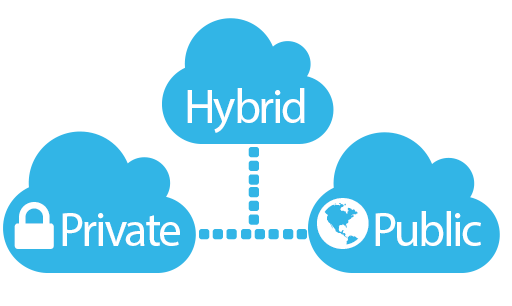

# Modelos de Implantação
---

Existem diversos modelos de nuvens, implantados de diferentes formas. As principais são:

* **Nuvem Pública**
* **Nuvem Privada**
* **Nuvem Híbrida**

*Tipos de nuvens. [Fonte](https://blog.znetlive.com/public-cloud-vs-private-cloud-vs-hybrid-cloud/)*

Também podem ser encontradas:

* **Nuvens Comunitárias**
* **Nuvens Distribuídas**
* **"Interclouds"**
* **"Multiclouds"**

## Nuvens Públicas
---

Uma nuvem é dita pública quando os serviços distribuídos por ela são veiculados a múltiplos indivíduos ou empresas. Os recursos providos pela nuvem são compartilhados, mas não necessariamente de livre acesso.

Nuvems com essa implantação costumam ser geridas por empresas que possuem o hardware para a operação desses sistemas. Os usuários, clientes, se submetem a um sistema de autorização para obter acesso aos recursos ofertados.

Alguns dos benefícios de se optar por nuvens públicas são:

* **Escalabilidade**: recursos sob-demanda com alta disponibilidade;
* **Custo**: sendo cobrada por consumo, esse tipo de nuvem possui um alto custo/benefício;
* **Maior tempo em operação**: manejados dinamicamente pelo provedor do serviço, os recursos desse tipo de nuvem estão sempre disponíveis;
* **Acessibilidade**: disponibilidade de serviços em escalaglobal;

## Nuvens Privadas
---

Uma nuvem é dita privada quando seu foco está no atendimento de uma empresa ou indivíduo. A infraestrutura pode encontrar-se hospedada remotamente ou localmente.

Esse tipo de implantação pode sofrer quando ocorre uma grande variação da carga caso não seja capaz de alocar e desalocar recursos rapidamente, seja pelo custo de sua ociosidade, seja pela incapacidade de atender grandes volumes de usuários.

Alguns dos benefícios de se optar por nuvens privadas são:

* **Segurança**: maior controle sobre o hardware e software, facilitando a integração com recursos locais;
* **Privacidade**: todos os processos estão sendo executados sobo controle do administrador da nuvem;
* **Controle**: todas as características de hardware e software estão sob a escolha do dono da nuvem;

## Nuvens Híbridas
---

É o modelo no qual parte da infraestrutura é disponibilizada por meio de uma nuvem pública e parte por meio de uma nuvem privada.

Ele é interessante por se tratar de uma maneira de se otimizar sua infraestrutura a fim de moldá-la a atender todas as demandas da melhor maneira possível. Em contrapartida, requer o constante monitoramento de diversos tipos de serviços, potencialmente integrados de formas diversas. Costuma-se considerar que existe um custo adicional ao administrar esse tipo de estrutura.
