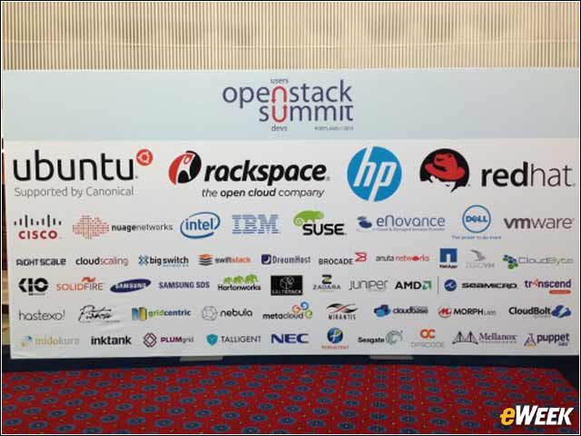

# OpenStack
---
Conforme apresentado anteriormente, o [OpenStack](https://www.openstack.org/) engloba um conjunto de softwares de código aberto que objetiva o gerenciamento de infraestruturas virtualizadas. Muitas vezes chamado de "Sistema Operacional da Nuvem", o OpenStack possúi uma forte comunidade que conta com nomes como VMware, IBM, Cisco, Dell, Red Hat, Canonical, dentre outros,  contribuindo para o seu desenvolvimento. Além disso, ele é utilizado por uma [vasta gama de
 usuários](https://www.openstack.org/user-stories/) em todos os setores da sociedade.

 

 *Screenshot da página do OpenStack no Github. [Fonte](https://github.com/openstack?utf8=%E2%9C%93&query=nova).*

O OpenStack trabalha com tecnologias corporativas e de código aberto populares tornando-o ideal para uma infra-estrutura heterogênea. Os diversos softwares que compõe o OpenStack se integram por meio de uma arquitetura modular de forma a permitir uma expansão horizontal da camada de infraestrutura na nuvem. Devido à sua natureza aberta, qualquer um pode adicionar componentes adicionais para OpenStack para ajudá-lo a satisfazer as suas necessidades.

## História
---

Iniciado em 2010 por meio de uma iniciativa conjunta entre a [NASA](https://www.nasa.gov/) e a empresa [Rackspace Hosting](https://www.rackspace.com/), o OpenStack teve sua primeira versão lançada poucos meses após o anúncio de que estava sendo desenvolvida uma plataforma de nuvem de [código aberto](https://github.com/openstack?page=1). Sua estrutura era baseada na plataforma [Nebula](https://www.nasa.gov/open/plan/nebula.html), da NASA, e no sistema de arquivos em nuvem da Rackspace.

*Nebula, plataforma em nuvem desenvolvida pela NASA. [Fonte](https://en.wikipedia.org/wiki/OpenStack#/media/File:NASA.Nebula.cloud.container.JPG).*

Desde sua criação, o OpenStack vem obtendo apoio de grandes empresas e organizações que atuam provendo softwares para nuvem, tend sido incorporado em muitos dos serviços oferecidos por diversas empresas na área.

## Componentes
---

OpenStack é composto de muitas partes móveis diferentes. Essa arquitetura permite a implantação demódulos de serviços ideais para cada caso. Nese trabalho ainda focaremos bastante atenção aos módulos distribuídos oficialmente pela comunidade OpneStack. Esses são:

* **Nova**
* **Swift**
* **Cinder**
* **Neutron**
* **Horizon**
* **Keystone**
* **Glance**
* **Ceilometer**
* **Heat**

## Maturidade
---

Apesar de novo, o OpenStack tem sido utilizado por uma vasta gama de *usuários de grande notoriedade*, por meio de *diversas distribuições*

*OpenStack Summit, 2013. [Fonte](http://www.eweek.com/cloud/slideshows/openstack-at-age-3-11-major-milestones-in-its-evolution).*

A comunidade OpenStack realiza convenções ([openstack summit](https://www.openstack.org/summit/)) semestrais para discutir a evolução e necessidades da plataforma, e, de fato, é uma das [comunidades de código](http://www.openstack.org/community/) aberto que mais tem crescido no mundo.
