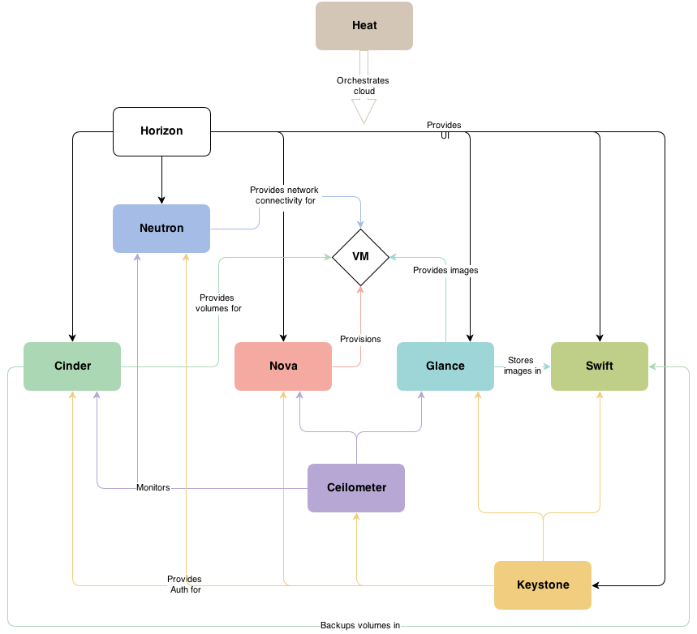

# Arquitetura
---

*OpenStack, o Sistema Operacional da Nuvem. [Fonte](http://www.openstack.org/software/).*

A arquitetura modular empregada no sistema OpenStack permite uma expansão horizontaldacamada de infraestrutura em nuvem. Basicamente, para cada aplicação, a implantação pode ser costumizada a fim de se obter o resultado que melhor atenda as demandas de custo e capacidade.

*Diagrama conceitual da arquitetura de uma aplicação genérica. [Fonte](http://docs.openstack.org/juno/install-guide/install/apt/content/ch_overview.html).*

Abaixo, vemos o exemplo de uma arquitetura real mínima com utilização do módulo de redes Neutron.

*Exemplo de uma arquitetura mínima. [Fonte](http://docs.openstack.org/juno/install-guide/install/apt/content/ch_overview.html#architecture_conceptual-architecture).*

A implantação deum sistema em nuvem pode tomar diversas formas. O OpenStack provê meios de padronizar aarquitetura utilizada de forma a simplificar (e unificar) os sistemas existentes. Para mais detalhes com relação a implantação do software, dimencionamento e requisitos, a [documentação](http://docs.openstack.org/juno/install-guide/install/apt/content/ch_preface.html) do OpenStack é uma excelente referência.
