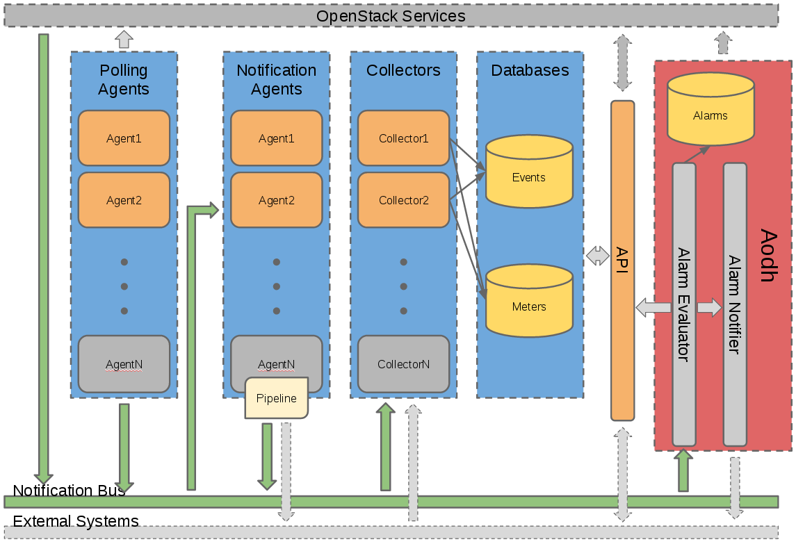
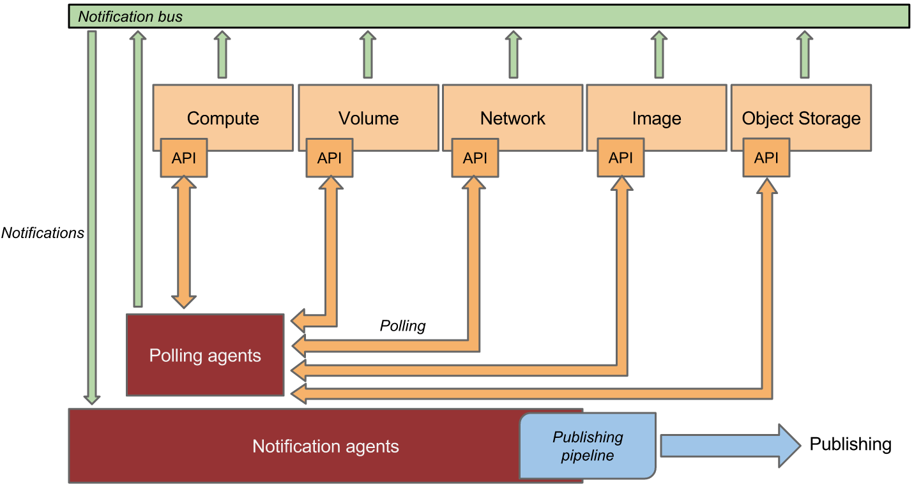
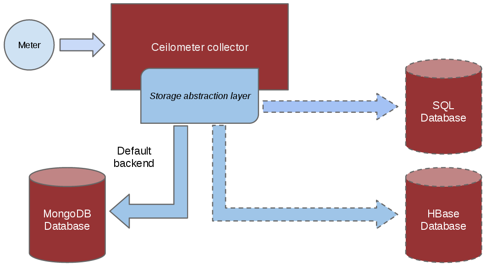
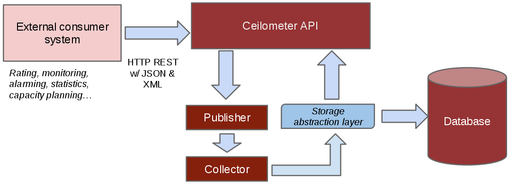

# Telemetry (Ceilometer)
---

O projeto de Telemetria visa se tornar a infra-estrutura do OpenStack para recolhimento de medidas e dados, para que essa tarefa nao precise ser descrita em mais de um modulo. Suas principais funcoes seriam monitoramento e medicao, porem seria de facil expansao para acomodar outras necessidades. Assim, os dados coletados podem ser distribuidos entre uma variedade de consumidores.

Notamos que o objetivo da Telemetria e somente realizar as medicoes, que ainda devem ser processadas e analisadas, o que deve ser feito alem do escopo do projeto. Dessa forma, o projeto trata somente dos primeiros passos para a resolucao de problemas de _billing_.

### Arquitetura do Sistema
---

*Esquema em alto nivel da arquitetura Ceilometer. [Fonte](http://docs.openstack.org/developer/ceilometer).*

Cada um dos servicos do Ceilometer sao craiados com a intencao de serem escalados horizontalemente. Podemos acrescentar trabalhadores e nos conforme necessario. Os principais servicos oferecidos pelo Ceilometer para solucionar problemas de medicao sao:

1. __Agente de Reconhecimento__ - Responsavel por olhar para os servicos OpenStack e identificar e criar medicoes.
2. __Agentes de Notificacao__ - Responsavel por escutar por notificacoes na fila de mensagens e converte-las em eventos e amostras.
3. __Coletor__ - Responsavel por coletar e armazenar dados de evento e medicao, criados pela notificacao e agentes de reconhecimento. 
4. __API__ - Servico para realizar queries e visualizar dados coletados pelo servico coletor.

Detalhando agora como os agentes de reconhecimento e notificacao se comunicam, podemos olhar para o esquema abaixo, onde podemos ver que os agentes de reconhecimento constantemente perguntam as diversas areas do sistema se ha alguma amostra nova a ser coletada, e quando encontrada, ela e roteada para o agente de notificacoes. Notamos que notificacoes tambem podem vir diretamente das varias areas do sistema.

*Esquema de comunicacao entre os agentes de reconhecimento e notificacao. [Fonte](http://docs.openstack.org/developer/ceilometer).*

Os dados recebidos pelo agente de notificacao sao entao transformados de maneira que sejam manipulaveis pelo coletor ou por sistemas externos, para que seja facil seu armazenamento / publicacao. Uma serie de trnsformacoes sao aplicadas em pipelines dependendo do tipo de informacao a ser processada.

Uma vez no coletor, a informacao e guardada em bancos de dados, para que possa ser consultada mais tarde pela API, de maneira que a informacao seja inteligivel pelo usuario final.

*Esquema de organizacao dos dados feita pelo coletor. [Fonte](http://docs.openstack.org/developer/ceilometer).*

*Esquema de acesso a API e sua comunicacao com o banco de dados. [Fonte](http://docs.openstack.org/developer/ceilometer).*
