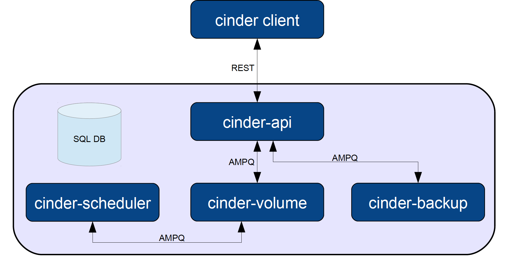

# Block Storage (Cinder)

O Cinder é o serviço de armazenamento de blocos do OpenStack. Ele é utilizado para providenciar armazenamento persistente (continuar existindo mesmo após a máquina virtual ser apagada) a instâncias de máquinas virtuais. Um bloco pode estar montado em uma máquina por vez, porém com a flexibilidade de ser desmontado e montado em outra máquina. A melhor analogia que pode ser feita é com um pen drive USB, que pode ser conectado em várias máquinas diferentes com os dados dentro dele permanecendo os mesmos.

## Arquitetura

* DB: Utilizado por todos os componentes para armazenamento de dados.

* cinder-api:  Componente que recebe as requisições HTTP.

* cinder-scheduler: Decide qual máquina física receberá qual bloco.

* cinder-volume: Gerencia dinamicamente dispositivos físicos.

* cinder-backup: Gerencia a realização de backups de blocos
