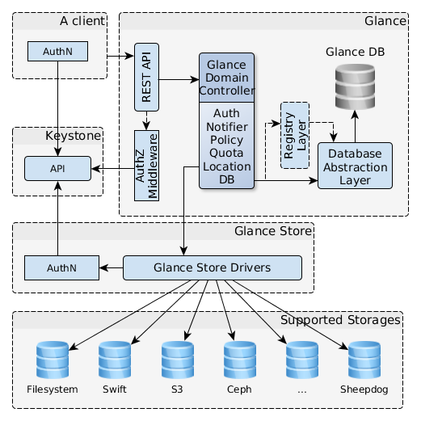

# Image Service (Glance)

O projeto Glance é um serviço de armazenamento de imagens de máquinas virtuais. Imagens e seus metadados podem ser pesquisados, registrados e baixados. Tudo isso por uma API RESTful.

Ele foi construído com os seguintes ideais em mente:
* Arquitetura modular
* Alta disponibilidade
* Tolerância a falhas
* Recuperável de falhas
* *Open Standards*: Ser uma implementação referência para uma API construída pela comunidade

## Arquitetura

* Cliente: Qualquer aplicação que use o servidor Glance.
* API REST: Expõe as funcionalidades do Glance por uma API RESTful.
* *Glance Domain Controller*: *middleware* que implementa as funções de autorização, notificações e conexões com DBs.
* *Glance Store*: Organiza as interações entre o Glance e os vários sistemas de armazenamento suportados.
