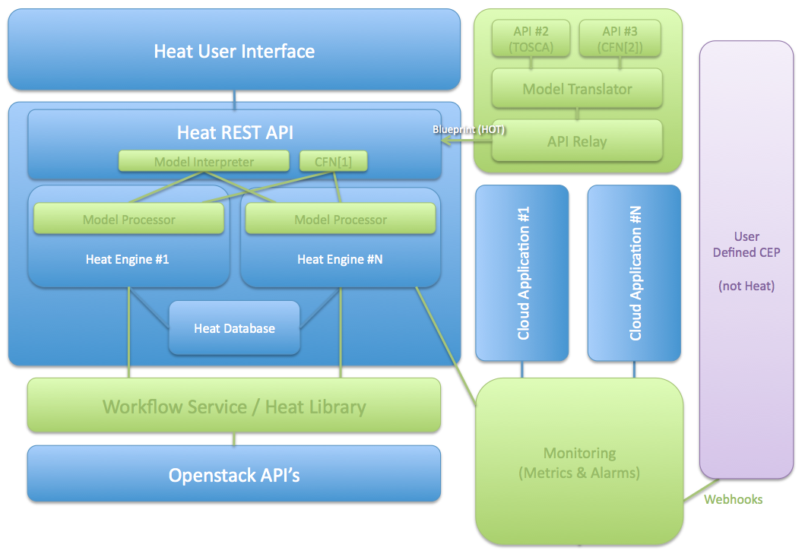

# Orchestration (Heat)
---

O programa de Orquestramento do OpenStack tem como missao criar um servico para gerenciamento de aplicacoes e infra-estruturas de nuvems OpenStack, ao longo de todo o seu ciclo de vida. Esse servico deve ser acessivel tanto para o ser humano quanto para maquinas.

O principal projeto no programa de Orquestramento e chamado de Heat, em portugues, calor. O projeto implementa uma engine para lancamento de diversas aplicacoes em nuvem baseado em padroes na forma de arquivos de texto que pode ser tratado como codigo. Uma aplicacao Heat nativa esta evoluindo junto ao OpenStack, sendo compativel com os padroes da AWS CloudFormation, para garantir a compatibilidade entre aplicacoes de CloudFormation e OpenStack. 

[Mais informacoes sobre a AWS CloudFormation](http://docs.amazonwebservices.com/AWSCloudFormation/latest/APIReference/Welcome.html?r=7078)

### Como Funciona
---

Um template Heat descreve infra-estruturas de aplicacoes em nuvem em um arquivo de texto mantido por humanos, portanto ele e legivel por humanos. Nele podemos descrever servidores, IPs flutuantes, volumes, grupos de seguranca, usuarios, entre outros.

Heat tambem prove um servico de autoescalamento que se integra com o Telemetry/Ceilometer, para que um grupo de escalas possa ser utilizado como recurso no seu template.

Templates tambem podem especificar as relacoes entre recursos, tais como "este volume esta conectado a tal servidor" ou "um usuario pode se conectar a estes servidores". Isso possibilita ao Heat chamar as APIs do OpenStack para criar sua infra-estrutura na ordem correta para lancar a aplicacao com sucesso.

O Heat gerencia o ciclo de vida inteiro da aplicacao - quando houver necessidade de realizar mudancas na infra-estrutura, basta simplesmente modificar o template e usa-lo para atualizar sua stack. Heat entao se responsabiliza de realizar todas as mudancas necessarias.

### Arquitetura
---

*Esquema da arquitetura Heat. [Fonte](https://wiki.openstack.org/wiki/Heat/Vision).*

Podemos ver no diagrama que o Heat e uma ferramenta que se comunica diretamente com as APIs do OpenStack atraves de sua propria API, onde podemos destacar os processadores de modelos e as engines.

Os processadores provem Queries no estilo AWS, compativeis com qualquer aplicacao no padrao AWS CloudFormation, e ele processa requisitos da API, mandando-os para os engines, onde o trabalho bruto e realizado, para que as aplicacoes sejam lancadas de acordo com os templates e se comuniquem com o restante do sistema propriamente.
